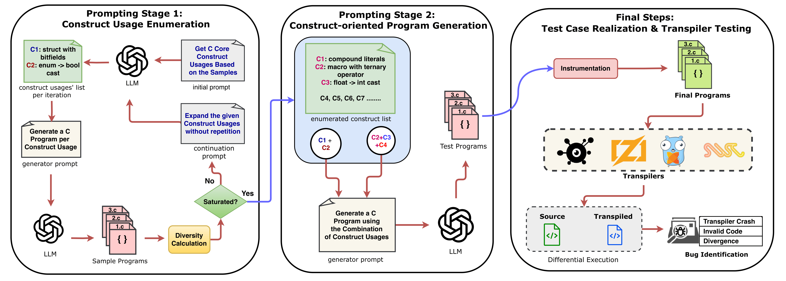

# PROGnosticator: Testing Source-to-Source Code Translators via Construct-oriented Fuzzing

This repository provides the source code for **PROGnosticator**: a construct-oriented prototype fuzzer for source-to-source code translators.

This work is presented in our paper **[PROGnosticator: Testing Source-to-Source Code Translators via Construct-oriented Fuzzing](https://futures.cs.utah.edu/papers/26FSE-a.pdf)**, appearing in the 2026 ACM International Conference on the Foundations of Software Engineering (FSE’26).

* [Using PROGnosticator](#using-PROGnosticator)
* [Additional Notes](#additional-notes)
* [Bug Trophy Case](#bug-trophy-case)

 

<table>
  <tr>
    <td><b>Citing this repository:</b></td>
    <td>
      <code class="rich-diff-level-one">@article{arafat:PROGnosticator, title = {PROGnosticator: Testing Source-to-Source Code Translators via Construct-oriented Fuzzing}, author = {Yeaseen Arafat and Stefan Nagy}, year = {2026}, issue_date = {July 2026}, publisher = {Association for Computing Machinery}, address = {New York, NY, USA}, volume = {3}, number = {FSE}, journal = {Proc. ACM Softw. Eng.}}</code>
    </td>
  </tr>
  <tr>
    <td><b>Maintainers:</b></td>
    <td>Yeaseen Arafat (<a href="mailto:y.arafat@utah.edu">y.arafat@utah.edu</a>) and Stefan Nagy (<a href="mailto:snagy@cs.utah.edu">snagy@cs.utah.edu</a>)</td>
  </tr>
  <tr>
    <td><b>License:</b></td>
    <td><a href="LICENSE">MIT License</a></td>
  </tr>
  <tr>
    <td><b>Disclaimer:</b></td>
    <td>This software is provided as-is with no warranty.</td>
  </tr>
</table>

# Using PROGnosticator

## Install Prerequisite Packages

Install prerequisite packages by running [setup.sh](setup.sh).

## Fuzzing a Transpiler

We provide example transpiler fuzzing setups in [transpilers](transpilers) (e.g. `c2rust`, `go2hx`, etc.). Each folder contains sample programs, a `PROGnosticatoring.py` launcher, and a short README.

Replicating a per-transpiler fuzzing setup generally requires the following:

1. Ensure the transpiler binary itself (e.g., `c2rust`) and any other necessary binaries (e.g., `clang`) are all accessible from your `$PATH` environment (details in each corresponding `README`).
2. Use the matching PROGnosticator-generated dataset from [dataset](dataset), e.g., [dataset/c_dataset.zip](dataset/c_dataset.zip) for C-input transpilers.
3. From the target transpiler folder, run: `python3 PROGnosticatoring.py <input_program_folder> <campaign_id>`.
4. Fuzzing campaign outputs are written to a local campaign directory: `campaign_<campaign_id>`.

# Additional Notes
Below are instructions for extending PROGnosticator:

## Running for a Supported Language

Supported language keys are: `c`, `go`, `js`, `rust`, `python`, and `java`. To try Rust:

1. Set your OpenAI API key `export OPENAI_API_KEY="your_openai_api_key_here"`
2. Run: `cd core && python main.py -F rust 0.2 2 10 --model gpt-4`.
3. See [core/README.md](core/README.md) for command options and parameter meanings.
4. Generated Rust programs are saved under: `core/construct_oriented_program_generator/language/rust/programs/`.
5. Enumerated Rust constructs are saved under: `core/construct_storage/rust/`.

## Supporting Other Languages

For setting up a new language, such as C++, follow [core/support_new_language.md](core/support_new_language.md).

## Supporting Other Transpilers

Follow any existing example in [transpilers](transpilers). Each transpiler folder contains a Python launcher script and sample seeds.

# Bug Trophy Case
| Transpiler | Reported Bugs |
| ---- | ---- |
| C2Rust | https://github.com/immunant/c2rust/issues/1165, https://github.com/immunant/c2rust/issues/1166, https://github.com/immunant/c2rust/issues/1168, https://github.com/immunant/c2rust/issues/1171, https://github.com/immunant/c2rust/issues/1208, https://github.com/immunant/c2rust/issues/1184, https://github.com/immunant/c2rust/issues/1217, https://github.com/immunant/c2rust/issues/1231, https://github.com/immunant/c2rust/issues/1233, https://github.com/immunant/c2rust/issues/1234, https://github.com/immunant/c2rust/issues/1236, https://github.com/immunant/c2rust/issues/1237, https://github.com/immunant/c2rust/issues/1238, https://github.com/immunant/c2rust/issues/1239, https://github.com/immunant/c2rust/issues/1240 |
| Go2Hx | https://github.com/go2hx/go2hx/issues/183, https://github.com/go2hx/go2hx/issues/184, https://github.com/go2hx/go2hx/issues/185, https://github.com/go2hx/go2hx/issues/186, https://github.com/go2hx/go2hx/issues/187, https://github.com/go2hx/go2hx/issues/226, https://github.com/go2hx/go2hx/issues/222, https://github.com/go2hx/go2hx/issues/225, https://github.com/go2hx/go2hx/issues/188, https://github.com/go2hx/go2hx/issues/230, https://github.com/go2hx/go2hx/issues/231, https://github.com/go2hx/go2hx/issues/232, https://github.com/go2hx/go2hx/issues/256, https://github.com/go2hx/go2hx/issues/276, https://github.com/go2hx/go2hx/issues/277 |
| Zig Translate-C | [ziglang/zig#22045](https://github.com/ziglang/zig/issues/22045), [ziglang/zig#22136](https://github.com/ziglang/zig/issues/22136), [ziglang/zig#22139](https://github.com/ziglang/zig/issues/22139), [ziglang/zig#22964](https://github.com/ziglang/zig/issues/22964), [ziglang/zig#23283](https://github.com/ziglang/zig/issues/23283), [ziglang/zig#22148](https://github.com/ziglang/zig/issues/22148), [ziglang/zig#23975](https://github.com/ziglang/zig/issues/23975), [ziglang/zig#23987](https://github.com/ziglang/zig/issues/23987), [ziglang/zig#24010](https://github.com/ziglang/zig/issues/24010) |
| CxGo | https://github.com/gotranspile/cxgo/issues/90, https://github.com/gotranspile/cxgo/issues/91, https://github.com/gotranspile/cxgo/issues/92, https://github.com/gotranspile/cxgo/issues/93, https://github.com/gotranspile/cxgo/issues/95, https://github.com/gotranspile/cxgo/issues/96, https://github.com/gotranspile/cxgo/issues/97, https://github.com/gotranspile/cxgo/issues/98, https://github.com/gotranspile/cxgo/issues/99, https://github.com/gotranspile/cxgo/issues/100, https://github.com/gotranspile/cxgo/issues/101 |
| SWC | https://github.com/swc-project/swc/issues/11039, https://github.com/swc-project/swc/issues/11040, https://github.com/swc-project/swc/issues/11045, https://github.com/swc-project/swc/issues/11046, https://github.com/swc-project/swc/issues/11047, https://github.com/swc-project/swc/issues/11048, https://github.com/swc-project/swc/issues/11049, https://github.com/swc-project/swc/issues/11050, https://github.com/swc-project/swc/issues/11051, https://github.com/swc-project/swc/issues/11052 |
| TinyGo | https://github.com/tinygo-org/tinygo/issues/4786, https://github.com/tinygo-org/tinygo/issues/4819 |
| Babel | https://github.com/babel/babel/issues/17190, https://github.com/babel/babel/issues/17502 |

If you find new bugs using PROGnosticator, please let us know!

# Acknowledgement
This material is based upon work supported by the National Science Foundation (NSF) under Award No. 2419798, and by the Defense Advanced Research Projects Agency (DARPA) under Award No. FA8750-24-2-0002, Subaward No. GR105409-SUB00001384.
